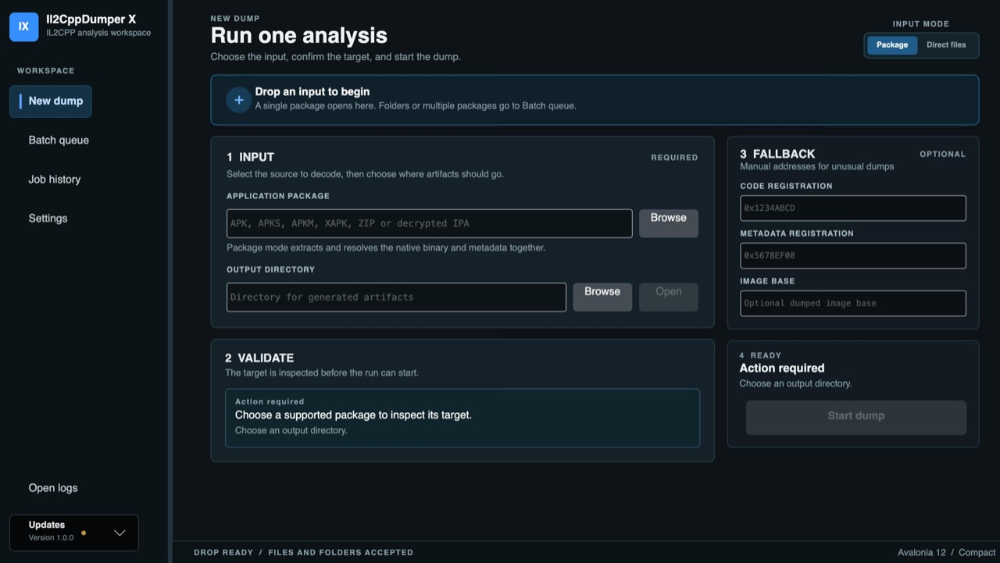

# Il2CppDumper-X

Cross-platform desktop application and CLI for extracting useful metadata from Unity IL2CPP builds.

Il2CppDumper-X is a community fork of [Il2CppDumper-GUI](https://github.com/AndnixSH/Il2CppDumper-GUI), with a cross-platform Avalonia desktop interface, a headless CLI, package discovery, batch processing, and release builds for Windows, Linux, and macOS.

## Download

Choose **Desktop GUI** if you want the graphical application. Choose **CLI** for scripts, automation, or CI/CD. Every package is self-contained and includes the .NET runtime.

| Operating system | Architecture | Desktop GUI | CLI |
| --- | --- | --- | --- |
| Windows | x64 | [Download GUI](https://github.com/slproduction/Il2CppDumper-X/releases/latest/download/Il2CppDumper-win-x64.zip) | [Download CLI](https://github.com/slproduction/Il2CppDumper-X/releases/latest/download/Il2CppDumper-cli-win-x64.zip) |
| Windows | ARM64 | [Download GUI](https://github.com/slproduction/Il2CppDumper-X/releases/latest/download/Il2CppDumper-win-arm64.zip) | [Download CLI](https://github.com/slproduction/Il2CppDumper-X/releases/latest/download/Il2CppDumper-cli-win-arm64.zip) |
| Linux | x64 | [Download GUI](https://github.com/slproduction/Il2CppDumper-X/releases/latest/download/Il2CppDumper-linux-x64.tar.gz) | [Download CLI](https://github.com/slproduction/Il2CppDumper-X/releases/latest/download/Il2CppDumper-cli-linux-x64.tar.gz) |
| Linux | ARM64 | [Download GUI](https://github.com/slproduction/Il2CppDumper-X/releases/latest/download/Il2CppDumper-linux-arm64.tar.gz) | [Download CLI](https://github.com/slproduction/Il2CppDumper-X/releases/latest/download/Il2CppDumper-cli-linux-arm64.tar.gz) |
| macOS | Apple Silicon (arm64) | [Download GUI](https://github.com/slproduction/Il2CppDumper-X/releases/latest/download/Il2CppDumper-osx-arm64.dmg) | [Download CLI](https://github.com/slproduction/Il2CppDumper-X/releases/latest/download/Il2CppDumper-cli-osx-arm64.tar.gz) |
| macOS | Intel (x64) | [Download GUI](https://github.com/slproduction/Il2CppDumper-X/releases/latest/download/Il2CppDumper-osx-x64.dmg) | [Download CLI](https://github.com/slproduction/Il2CppDumper-X/releases/latest/download/Il2CppDumper-cli-osx-x64.tar.gz) |

The GUI and CLI are published as separate packages. On macOS, the GUI is distributed exclusively as a DMG. SHA-256 checksums are listed in the [latest release description](https://github.com/slproduction/Il2CppDumper-X/releases/latest).

## Screenshot



## Features

- Cross-platform desktop application for Windows, Linux, and macOS
- Windows x64 and ARM64 support
- Linux x64 and ARM64 support
- macOS Intel and Apple Silicon support
- Manual binary and metadata workflow
- APK, APKS, APKM, XAPK, ZIP, and decrypted IPA package discovery
- Batch processing for multiple packages
- Headless CLI with `dump` and `batch` commands
- Dummy DLL generation for tools such as dnSpy, ILSpy, UABE, and UtinyRipper
- `il2cpp.h` structure header generation
- IDA, Ghidra, Binary Ninja, and Hopper analysis scripts
- Unity metadata versions 16-39, including Unity 6 / metadata v39 support
- ELF, ELF64, Mach-O, PE, NSO, and WebAssembly formats
- Android memory-dump workflows using dumped `libil2cpp.so`

## Usage

### Desktop

1. Download the GUI package for your operating system and architecture.
2. On Windows or Linux, extract the archive. On macOS, open the DMG and drag `Il2CppDumper` to Applications.
3. Start `Il2CppDumper`. On the first macOS launch, Control-click the app, choose **Open**, then confirm **Open**.
4. Select a package, or provide the executable and `global-metadata.dat` manually.

### CLI

Dump a binary and metadata pair:

```bash
il2cppdumper dump GameAssembly.dll global-metadata.dat -o ./output
```

Dump an Android package:

```bash
il2cppdumper dump game.apk -o ./output --arch arm64-v8a
```

Process packages recursively:

```bash
il2cppdumper batch ./packages -o ./results --recursive
```

Run `il2cppdumper help` to see all available options.

## Build From Source

Requirements:

- [.NET 10 SDK](https://dotnet.microsoft.com/download/dotnet/10.0)

Build the solution:

```bash
dotnet build Il2CppDumper-X.slnx --configuration Release
```

Run the test suite:

```bash
dotnet test tests/Il2CppDumper.Tests/Il2CppDumper.Tests.csproj --configuration Release
```

Run the desktop application:

```bash
dotnet run --project src/Il2CppDumper.Desktop/Il2CppDumper.Desktop.csproj
```

Run the CLI project:

```bash
dotnet run --project src/Il2CppDumper.Cli/Il2CppDumper.Cli.csproj -- help
```

## Project Structure

| Project | Purpose |
| --- | --- |
| `Il2CppDumper.Desktop` | Avalonia desktop application |
| `Il2CppDumper.Cli` | Headless CLI for automation |
| `Il2CppDumper.Application` | Shared dump pipeline, progress, cancellation, and result models |
| `Il2CppDumper.Packages` | Package discovery and extraction for APK, APKS, APKM, XAPK, ZIP, and IPA |
| `Il2CppDumper.Core` | Platform-independent metadata and executable processing |

## Troubleshooting

### Metadata file is not valid

Make sure the selected file is the original `global-metadata.dat`. Some games obfuscate or encrypt this file, which is outside the scope of this project.

### Automatic mode cannot find registration addresses

Try manual mode with the correct `CodeRegistration` and `MetadataRegistration` addresses. For protected Android builds, dump `libil2cpp.so` from memory first and use the dumped binary.

### Antivirus warning

Reverse-engineering and modding tools are frequently flagged by antivirus vendors. Verify the downloaded archive using the SHA-256 checksum published in the release description before running it.

### macOS reports that the app cannot be opened

The macOS build has an integrity signature but is not Apple-notarized. After copying it from the DMG to Applications, Control-click `Il2CppDumper`, choose **Open**, and confirm **Open**. This approval is required only on the first launch.

## Fork And Credits

This repository is a fork of [AndnixSH/Il2CppDumper-GUI](https://github.com/AndnixSH/Il2CppDumper-GUI). The fork preserves the project lineage while adding and maintaining the cross-platform Il2CppDumper-X application and CLI.

Original and contributing projects:

- [Perfare/Il2CppDumper](https://github.com/Perfare/Il2CppDumper)
- [Il2CppInspector](https://github.com/djkaty/Il2CppInspector)
- [Il2CppDumper-GUI](https://github.com/AndnixSH/Il2CppDumper-GUI)

Contributors:

- **Axey** - Unity 6 / metadata v39 upgrade and performance options
- **AndnixSH** - GUI work and project foundation
- **djkaty** - Il2CppInspector code and guidance
- **T5ive** - Il2CppDumper-GUI code

## License

MIT License. See [LICENSE](./LICENSE) for details.
